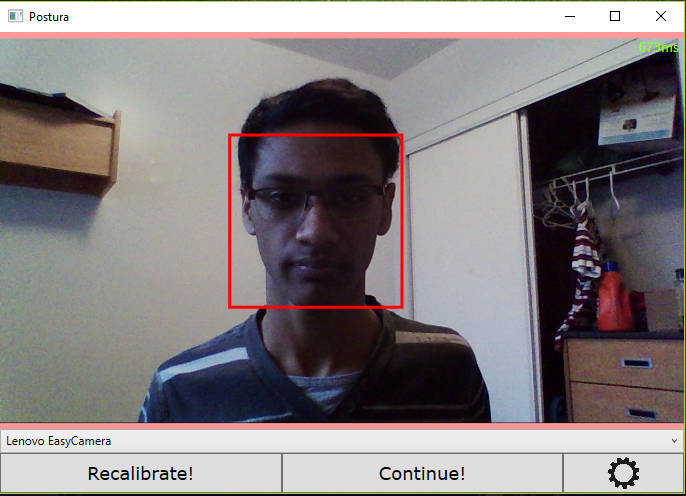
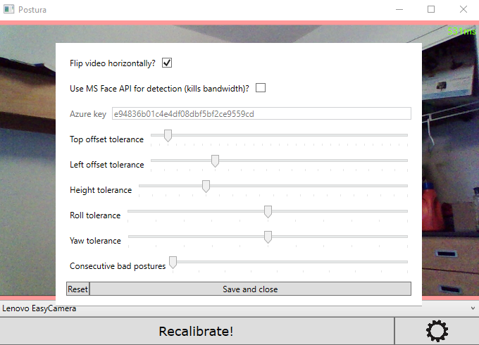
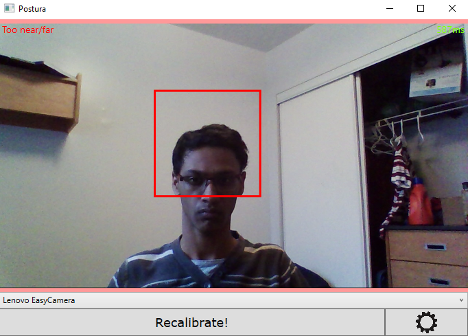
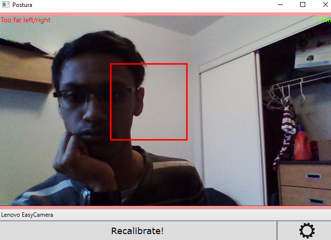
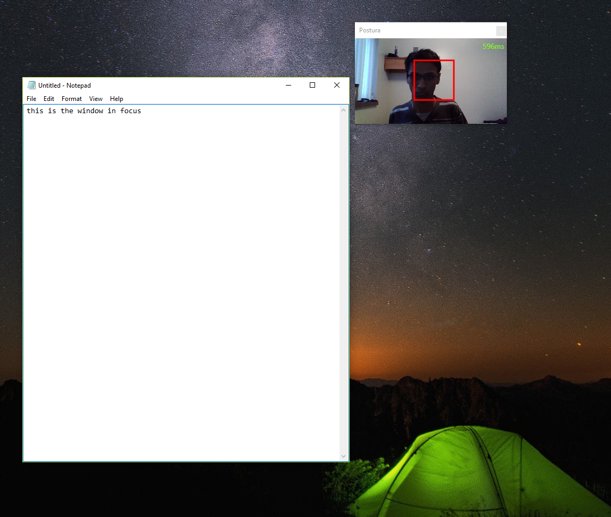

# Posture-Detection
A posture detection app that I'm working on. Uses Microsoft Azure's FaceAPI and EmguCV (.NET wrapper for OpenCV).

## Motivation
I have had some pretty bad neck and shoulder pain in the past from bad posture (especially while playing music). I spend enough time in front of a computer that how I am sitting has a serious effect on my pain.  I built this program to remind myself to sit straight while in front of a computer by tracking my face through a webcam and noting changes to a calibration photograph. I would like to thank Sina Rezaeizadeh, Shoaib Shaikh, and Felipe Santos for helping come up with the inspiration for this app at MSFTHacks at the  University of Toronto.

## Examples
Here is the calibration photograph. You can see my face being boxed and the general layout of the app.

---

Here is the settings menu. It contains the tolerance to horizontal and vertical movement, as well as height and width (i.e., how far you are from the camera). It also has an option to use Microsoft Azure's FaceAPI for face detection instead. Though the latency is much higher, the processing is a bit better and you save the processing cost on your end. It also gives access to roll and yaw measurements (and a whole host of others that I'm ignoring), if you so desire. The consecutive bad photos is a measure of how many photos you can have in bad posture before you are alerted (it's pretty frustrating when set at 1).

---

In this photo I'm too far back (face is smaller than the target red box), so the top left alerts me (there is also an alert sound, but that's kind of hard to show in a picture).

---

I'm too far to the left here (face is to the left of the target red box).

---

You can work on other things and Postura will become small (but stay on top).

## Downloading
Please download from my [Waterloo website](https://www.student.cs.uwaterloo.ca/~a23sriva/). I tried using ClickOnce publishing but something broke and to be honest I don't know enough to fix it yet.

## Goals
- Better face detection (I might make my own!)
- Settings menu has an interactive depiction of top/bottom/left/right tolerance
- Port to C++?!
- Publish on Windows Store
- Figure out h
